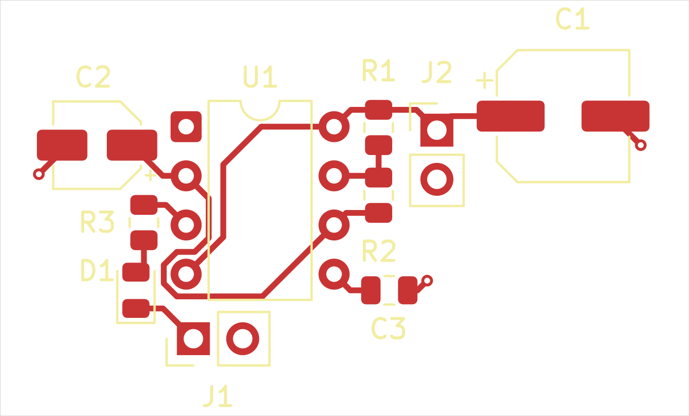

# NE555 Astable LED Blinker

A 5V LED blinker designed in KiCad 10.0 using an NE555P timer in astable mode. The schematic includes a 10k/100k timing resistor network, a 10uF timing capacitor, a 1k LED resistor, 100uF supply decoupling, and 10nF control-pin bypassing.

## Files

- Editable KiCad project, schematic, and PCB source files in the repository root
- [Complete project archive](555_Timer_LED_Blinker.zip), including the supplied Gerber and drill exports
- PNG and SVG previews generated from the source with KiCad 10.0

## Design status

Fresh KiCad 10.0.6 checks on 2026-10-05 reported **0 DRC violations, 0 unconnected items, 0 schematic parity issues, and 0 ERC violations** under the supplied project settings. The JSON reports record ignored checks and included severities; this does not establish hardware testing. The supplied fabrication exports are preserved as provided.

- [DRC report](555_Timer_LED_Blinker-DRC.json)
- [ERC report](555_Timer_LED_Blinker-ERC.json)
