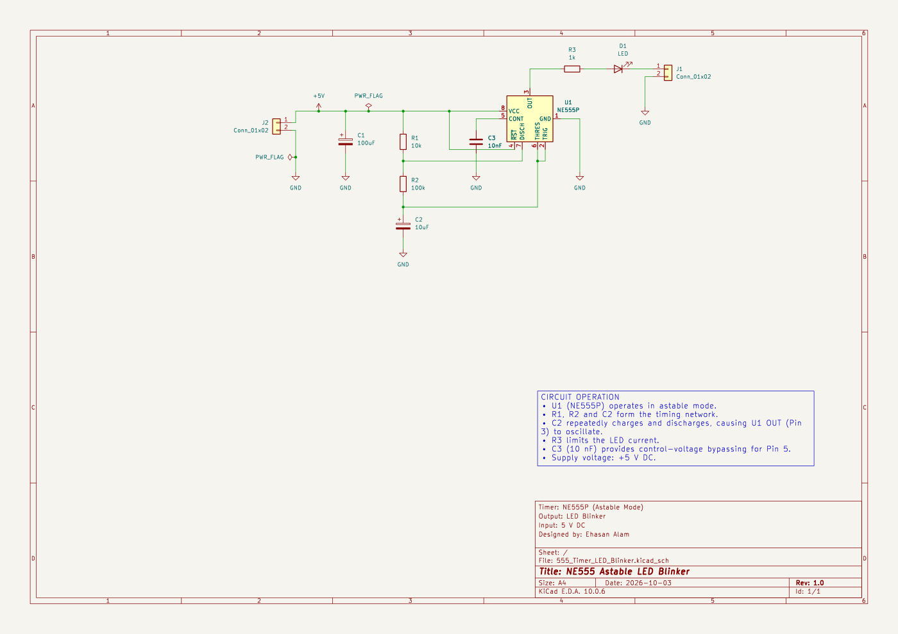

# NE555 Astable LED Blinker

A 5V LED blinker designed in KiCad 10.0 using an NE555P timer in astable mode. The schematic includes a 10k/100k timing resistor network, a 10uF timing capacitor, a 1k LED resistor, 100uF supply decoupling, and 10nF control-pin bypassing.

## Files

- Editable KiCad project, schematic, and PCB source files in the project source folder
- [Complete project archive](Archives/555_Timer_LED_Blinker.zip), including the supplied Gerber and drill exports
- PNG and SVG previews generated from the source with KiCad 10.0

## Design status

The preserved KiCad 10.0.6 reports dated 2026-10-05 reported **0 DRC violations, 0 unconnected items, 0 schematic parity issues, and 0 ERC violations** under the supplied project settings. The JSON reports record ignored checks and included severities; this does not establish hardware testing. The supplied fabrication exports are preserved as provided.

- [DRC report](Reports/555_Timer_LED_Blinker-DRC.json)
- [ERC report](Reports/555_Timer_LED_Blinker-ERC.json)

## Browse this project

Open [555_Timer_LED_Blinker.kicad_pro](KiCad_Project/555_Timer_LED_Blinker.kicad_pro) in KiCad 10. Download or clone the whole repository to keep related files together.

| Folder | Contents |
| :--- | :--- |
| [Archives/](Archives/) | Unchanged original complete project ZIP |
| [Documentation/](Documentation/) | Supporting documentation and preserved source-reference snapshots |
| [Images/](Images/) | Existing schematic and board previews |
| [KiCad_Project/](KiCad_Project/) | Editable project, schematic and PCB files |
| [Manufacturing/](Manufacturing/) | Existing fabrication, drill and assembly outputs |
| [Reports/](Reports/) | Saved design-check reports |

## BOM and later local manufacturing revision

The recovered [BOM CSV](BOM/555_Timer_LED_Blinker.csv) contains 9 grouped rows and 10 components, including J1/J2 grouped as quantity 2. Manufacturer and MPN fields are supplied project metadata; purchasing suitability is not established.

The OneDrive local revision has added schematic BOM fields and changes to the PCB outline, capacitor placement and routing. It is preserved as a separate [local source snapshot](Documentation/Local_Revision_2026-10-06/KiCad_Project/) with its [local Gerber/drill files](Manufacturing/Local_Revision_2026-10-06/Gerbers/). The primary `KiCad_Project/`, previews and 2026-10-05 reports remain the existing GitHub revision. The old reports do not validate the later local revision. See [manufacturing documentation](Manufacturing/README.md) before choosing an output set.
