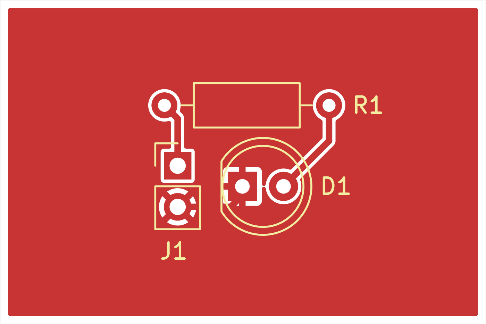
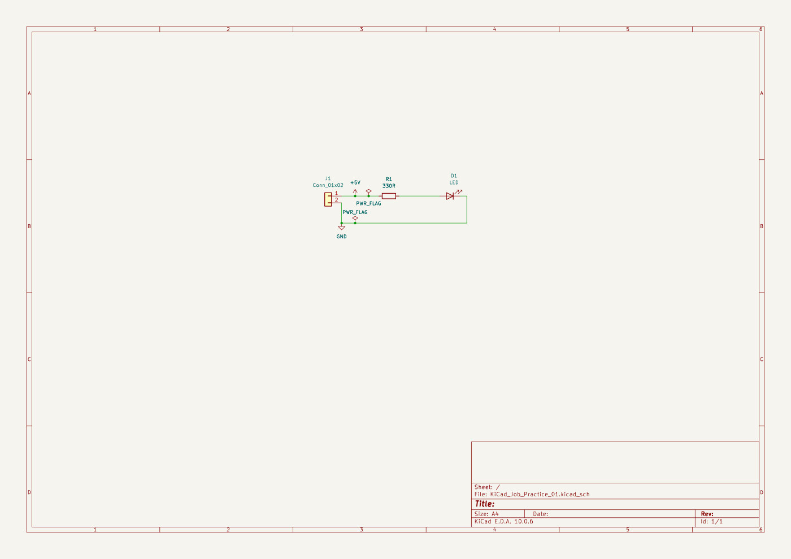

# LED Basic Board

A three-footprint LED indicator practice board with a 330-ohm resistor and two-pin connector.

## Included files

- Editable `.kicad_pro`, `.kicad_sch`, and `.kicad_pcb` files
- [Complete project with supplied Gerbers and drill exports](Archives/LED_Basic_Board.zip)
- SVG and PNG previews generated with the installed KiCad 10.0 CLI

## Status

Practice design. Existing fabrication exports are included; ERC/DRC and hardware test status have not been established.

## Use and validation

Open editable project files in their original CAD application. The archives preserve project subfolders; extract an archive before opening its project. External libraries or 3D-model paths may need to be remapped on another computer.

These are portfolio design files. Existing reports are snapshots from their recorded dates; fabrication exports are not evidence of manufactured or bench-tested hardware. Review the design and rerun the checks before fabrication.

No blanket license is assigned. Third-party components, libraries, and tutorial material retain their original rights and terms.

## Browse this project

Open [LED_Basic_Board.kicad_pro](KiCad_Project/LED_Basic_Board.kicad_pro) in KiCad 10. Download or clone the whole repository to keep related files together.

| Folder | Contents |
| :--- | :--- |
| [Archives/](Archives/) | Unchanged original complete project ZIP |
| [Documentation/](Documentation/) | Supporting documentation and preserved source-reference snapshots |
| [Images/](Images/) | Existing schematic and board previews |
| [KiCad_Project/](KiCad_Project/) | Editable project, schematic and PCB files |
| [Manufacturing/](Manufacturing/) | Existing fabrication, drill and assembly outputs |
