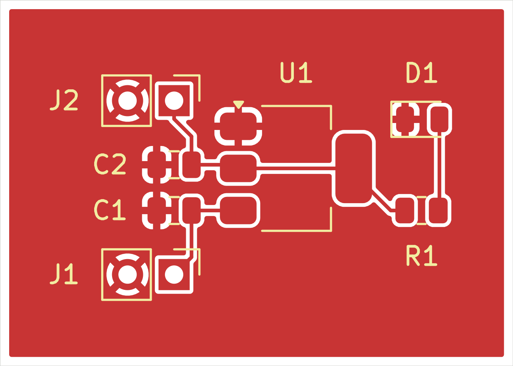

# KiCad PCB Design Portfolio

**LED indicators · Voltage regulation · NE555 timer · Schematic-to-PCB workflow**

Three practice projects with editable source files, supplied fabrication exports, and generated board/schematic previews.

## Projects

| Project | Scope |
| :--- | :--- |
| [LED Basic Board](LED_Basic_Board.md) | A three-footprint LED indicator practice board with a 330-ohm resistor and two-pin connector. |
| [5V to 3V3 LDO Board](5V_to_3V3_LDO_Board.md) | A seven-footprint AMS1117-3.3 regulator practice board with capacitors, input/output connectors, and an LED indicator. |
| [NE555 Astable LED Blinker](555_Timer_LED_Blinker.md) | A 5V timer-based LED blinker with editable source, Gerbers, drill exports, and previews. |

## Open a design

Open the corresponding `.kicad_pro` in KiCad 10.0. The project source files are available in the repository root; download a ZIP for the supplied Gerbers and drill files.

## Use and validation

Open editable project files in their original CAD application. The archives preserve project subfolders; extract an archive before opening its project. External libraries or 3D-model paths may need to be remapped on another computer.

These are portfolio design files. Existing reports are snapshots from their recorded dates; fabrication exports are not evidence of manufactured or bench-tested hardware. Review the design and rerun the checks before fabrication.

No blanket license is assigned. Third-party components, libraries, and tutorial material retain their original rights and terms.
