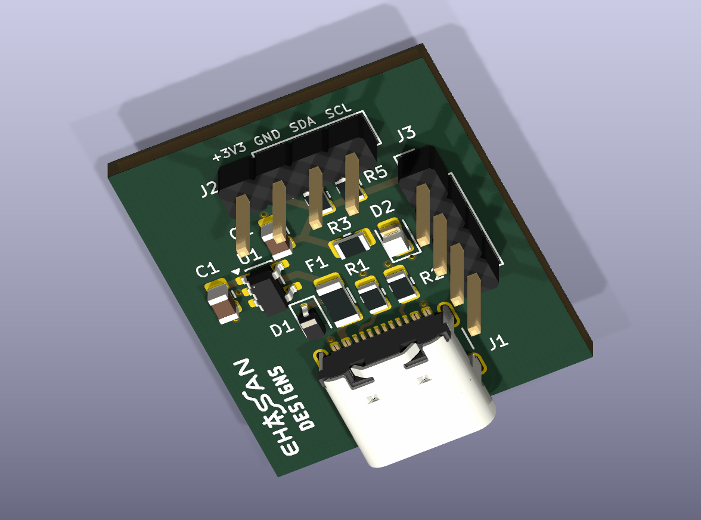
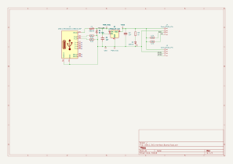
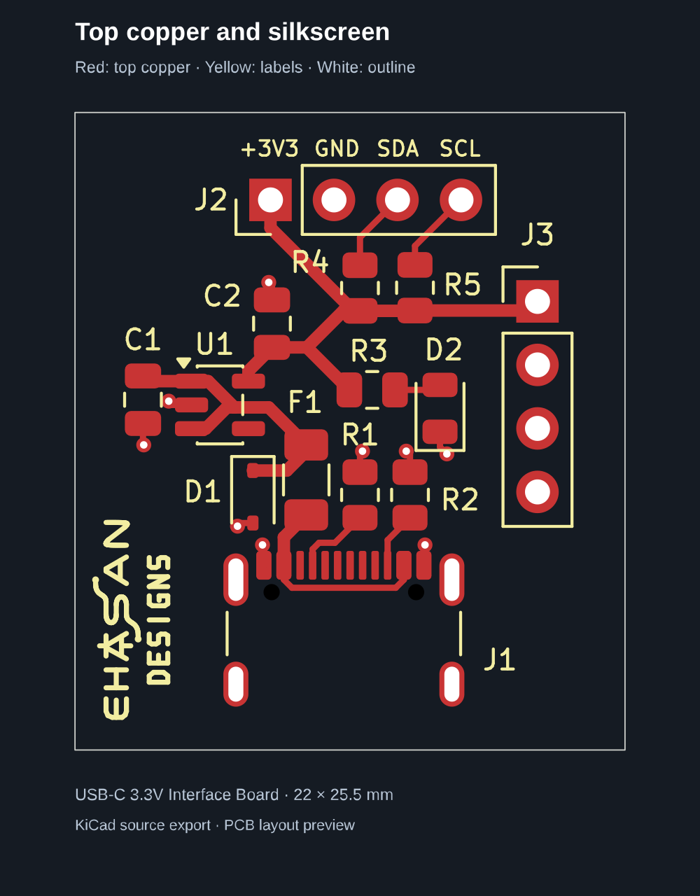

# USB-C 3.3V Interface Board

**A compact two-layer KiCad practice PCB for USB-C 5V power input, nominal 3.3V regulation and I²C/GPIO header connections.**

## Project overview

The board accepts nominal 5V power through a USB-C receptacle and uses an AP2112K-3.3 LDO to supply external low-power electronics. Separate 5.1kΩ CC pull-down resistors implement a USB-C power sink. USB data transfer and USB Power Delivery negotiation are not implemented.

The I²C and GPIO headers provide connections only. There is no onboard microcontroller or I²C controller. SDA/SCL each have a 4.7kΩ pull-up to 3.3V; GPIO1/GPIO2 each terminate at a single header pin and are not driven on this board.

## Technical specifications

| Parameter | Specification |
| :--- | :--- |
| CAD application | KiCad 10.0; exports/checks generated with 10.0.6 |
| Board outline | 22 × 25.5 mm, measured between outline centerlines |
| Copper layers | 2: F.Cu and B.Cu |
| Nominal input | 5V DC via USB-C |
| Nominal regulated output | 3.3V DC |
| Regulator | AP2112K-3.3 |
| Input protection components | 500mA-rated resettable polyfuse and PESD5V0S1UA TVS |
| Interfaces | Two 1×4 headers for I²C and GPIO connections |
| Layout | Top-side components/routing and bottom-layer GND copper zone |
| Manufacturing outputs | Seven Gerbers, PTH/NPTH Excellon drills and Gerber job file |

The fuse rating does not establish a guaranteed continuous output current. Available output current depends on regulator dissipation, PCB thermal conditions, ambient temperature and component ratings.

## Main components

| Reference | Component/value | Purpose |
| :--- | :--- | :--- |
| J1 | GCT USB4105 USB-C receptacle | Power input |
| R1, R2 | 5.1kΩ | CC1/CC2 pull-down resistors |
| F1 | 500mA resettable polyfuse | Input protection component |
| D1 | PESD5V0S1UA | TVS protection component |
| U1 | AP2112K-3.3 | Nominal 3.3V regulation |
| C1, C2 | 1µF | Input/output decoupling |
| R3, D2 | 1kΩ and green LED | Power indication |
| R4, R5 | 4.7kΩ | SDA/SCL pull-ups |
| J2, J3 | 1×4, 2.54mm headers | External connections |

[BOM CSV](BOM/USB_C_3V3_Interface_Board.csv) contains ten grouped rows covering fourteen components, including footprints and manufacturer/MPN fields. Values, quantities, references and fields were checked against the exported schematic netlist. These checks do not establish component availability or suitability for every operating condition.

## Connector pinouts

| Pin | J2 — I²C | J3 — GPIO |
| :---: | :--- | :--- |
| 1 | +3V3 | +3V3 |
| 2 | GND | GND |
| 3 | SDA | GPIO1 |
| 4 | SCL | GPIO2 |

Pinouts were checked against the schematic netlist. Use the source schematic when connecting external hardware.

## Project files

| Folder | Contents |
| :--- | :--- |
| [KiCad_Project](KiCad_Project/) | Editable project, schematic and PCB |
| [Images](Images/) | Schematic SVG, PCB layer SVG and rendered 3D preview |
| [Reports](Reports/README.md) | Current ERC/DRC JSON and validation notes |
| [BOM](BOM/USB_C_3V3_Interface_Board.csv) | Component list |
| [Manufacturing](Manufacturing/README.md) | Supplied Gerber/drill exports and download package |
| [Archives](Archives/) | Source/BOM/manufacturing snapshot ZIP |

Open [USB_C_3V3_Interface_Board.kicad_pro](KiCad_Project/USB_C_3V3_Interface_Board.kicad_pro) in KiCad 10.0. Footprints and 3D models use standard KiCad libraries; preview renders depend on the installed model libraries. Temporary lock files, local UI preferences and editor history are not part of the portfolio upload.

## Design verification — 2026-10-09

- [DRC](Reports/DRC.json): zero non-excluded violations, zero unconnected items and zero schematic-parity findings under the saved project settings. **Four excluded USB-C pad-to-NPTH hole-clearance errors remain**: actual clearance 0.1944mm versus the configured 0.2500mm requirement.
- [ERC](Reports/ERC.json): zero error-severity records. The all-severity export contains four warning records for two unique GPIO label findings: GPIO1/GPIO2 each appear once normally and once as excluded. These signals each connect to only one header pin. This is disclosed rather than presented as a zero-warning ERC result.
- Reports include the saved settings' ignored-check lists. Exclusions and disabled checks limit the scope of a clean result.
- BOM fields and header pinouts were compared with the source netlist. Schematic, PCB and 3D previews were generated from the saved source snapshot.

No physical fabrication, assembly, load testing, thermal testing or ESD testing is documented. The connector hole clearances require fabrication review. TVS working/clamping voltage and regulator thermal capability still require operating-condition validation. Manufacturing outputs are supplied exports, not a fabrication approval.

## Project images

### Schematic

### PCB layout

The PCB SVG combines top/bottom copper, front silkscreen and outline; the 3D image above is a generated preview, not a photograph of assembled hardware.

## Author

**Ehasan Alam Chowdhury** — Electrical & Electronic Engineering (EEE)

GitHub: [ehasunchy](https://github.com/ehasunchy)

Part of a practical PCB design portfolio. [Return to the KiCad portfolio](../README.md).
